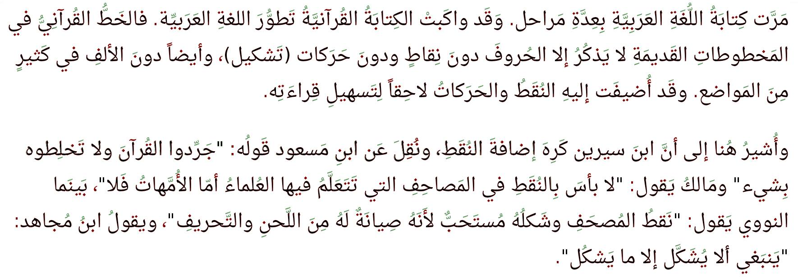

بسم الله الرحمن الرحيم

# تلوين التشكيل والنقط

اللغة العربية مِن أكثر اللغات البشرية تطورًا. ورغم انضباط كتابتها إلا أننا نتثاقل في بعض الأحيان من رؤية التشكيل الزائد في الكلمات. بل إنّ القارئ العربي قادر على فهم النص الذي يخلو من التشكيل والنقط بشكلٍ مُثيرٍ للدهشة والإعجاب معًا.

هذا لا ينطبق، بالطبع، على كل شيء ولهذا وُجِدَت النقاط والتشكيل في الأساس. ولكنني وجدت أن قدرة الواحد منا على قراءة النص العربي تتحسن بشكل كبير إذا استطعنا أن نُظهر التشكيل والنقط بلونٍ مختلف يكون التركيز عليه أخف (لون باهت) بحيث تركز العين على قراءة النص وتركز في التشكيل والنقط عندما يستشكل النص فقط. كما أن التلوين يُضيف حيويًة للنص العربي مما يجعل قرائته أكثر إمتاعًا وربما تكون أنسبُ للأطفال مع الحرص على اختيار تشكيلة الألوان المناسبة.

أضع بين أيديكم نموذجًا أوليا لإثبات الفكرة (Proof of concept) (وهو صفحة "هتمل" مع نص جافاسكريب مع خط أندوريد نسخ مُعدّل) يتيح تلوين التشكيل والنقاط وإشارات الترقيم كلٌ بلونٍ مختلف عن لون الخط الأصلي. 

البرنامج يقوم على حيلة رسم الكلام مرتين حتى يتمايز لون النقاط عن النص الأصلي. وواجهتني مشكلة عندما طبقته باستخدام الخطوط العربية لذلك اضطررتُ إلى تعديل بعض الأحرف واعتمدت خط أندرويد نسخ من غوغل وقمت بتطبيق التغيررات على ملف الخط مباشرة باستخدام برنامج تحرير الخطوط "فونت فورج". تجدون ملف الخط المُعدل في هذا المستودع.

وهذا مثال كيف يبدو النص بعد التلوين:

كما يمكنكم طبعا إخفاء النقط والتشكيل بشكل كامل إن أردتم.

ملاحظة هامّة: لم يُعر المتصفح غوغل كروم اهتماما كافيا بعرض النص العربي بالشكل الصحيح وقد تابعتُ الأمر معهم دون جدوى. ولكن في المقابل فإن متصفح موزلا "فايرفوكس" يدعم النصوص العربية بشكلٍ أفضل بكثير. ولذلك فإن هذا البرنامج لا يعمل بالشكل المطلوب إلى على فايرفوكس (على الأقل عند وقت إصدار هذا البرنامج).

[لتجربة البرنامج بشكل مباشر اضغطوا هنا ](https://kefahi.github.io/tashkeel/) 
(لا تنسوا أن تفتحوا الرابط مِن خلال المتصفح فايرفوكس)

----

### مُلحق:

جدول تحويل الحروف المنقطة والمهموزة إلى نظيرها غير النقط ولا المهموز

| اسم الحرف | رمزه | رمز الحرف المجرد |
| --- | --- | --- |
| ب |628|66E|
| ت |62A|66E|
| ث |62B|66E|
| ذ |630|62F|
| ز |632|631|
| ج |62C|62D|
| خ |62C|62D|
| ش |634|633|
| ض |636|635|
| ظ |638|637|
| غ |63A|639|
| ق |642|66F|
| ف |641|6A1|
| ي |64A|649|
| ة |629|647|
| ن |646|6BA|
| إ |625|627|
| أ |623|627|
| آ |622|627|

----

### مُلحق: 

قائمة الأحرف التي يلزم تعديلها على الخط ليعمل بالشكل المطلوب   

هذه رموز المحارف المُوَحَّدَة "يونيكود" التي لزم تعديلها. والتعديل كان فقط في مطابقة الأحرف في قياس العرض مع الأحرف الأصلية.

| اسم الحرف | شكل الحرف  | الترميز السداسي عشر |
| ---- |:---:| ---:|
|Arabic letter Yah initial form| يـ |FEF3 |
|Arabic letter Yah medial form| ـيـ |FEF4|
|Arabic letter Beh initial form| بـ |FE91|
|Arabic letter Beh medial form|  ـبـ |FE92|
|Arabic letter Beh final form| ـب |FE90|
|Arabic letter Beh isolated form| ب |FE8F|
|Arabic letter Teh initial form| تـ |FE97|
|Arabic letter Teh medial form| ـتـ |FE98|
|Arabic letter Teh final form|  ـت |FE96 |
|Arabic letter Teh isolated form| ت |FE95 |
|Arabic letter Theh initial form| ثـ |FE9B|
|Arabic letter Theh medial form| ـثـ |FE9C|
|Arabic letter Theh final form| ـث |FE9A|
|Arabic letter Theh isolated form| ث |FE99|
|Arabic letter Teh marbuta final form| ـة |FE94|
|Arabic letter Teh marbuta isolated form| ة |FE93|

